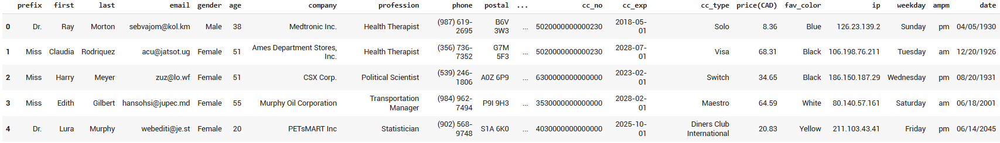

# Ecommerce Purchases Analysis

## 📌Overview
This project involves analyzing a synthetic dataset of ecommerce purchases to answer various business questions. The dataset contains 30,000 entries with customer information, purchase details, and payment information. The goal is to utilize the Pandas library in Python to perform data analysis and derive insights that can help the client understand their customer base better.

## 📚Table of Contents
- [Project Description](#Project_Description)
- [Dataset](#Dataset)
- [Installation](#Installation)
- [Usage](#Usage)
- [Results]([#Results)
- [Conclusion](#Conclusion)

## 📌Project Description
The project aims to analyze customer purchase behavior using a dataset that includes personal information, purchase details, and payment information. The analysis will help answer questions related to customer demographics, spending habits, and payment methods.

## 🚀 Dataset
The dataset is a CSV file named Cust_Purch_Data.csv and contains the following columns:
- prefix: Title of the customer (e.g., Mr., Mrs., Dr.)
- first: First name of the customer
- last: Last name of the customer
- email: Email address of the customer
- gender: Gender of the customer
- age: Age of the customer
- company: Company where the customer works
- profession: Profession of the customer
- phone: Phone number of the customer
- postal: Postal code of the customer
- province: Province of the customer
- cc_no: Credit card number
- cc_exp: Credit card expiration date
- cc_type: Type of credit card (e.g., Visa, MasterCard)
- price(CAD): Amount spent in Canadian dollars
- fav_color: Favorite color of the customer
- ip: IP address of the customer
- weekday: Day of the week when the purchase was made
- ampm: AM/PM indicator for the purchase time
- date: Date of the purchase

## 📊Technologies Used
- Python 3.x
- Pandas
- Google Colab (for running the Jupyter notebook)

## 📈Analysis Report Process program and output

**Import Pandas and Read the csv file**

```sql
 import pandas as pd

 #load file
 from google.colab import files
 files.upload()
```

**Its good idea to see how the data look like, display first 5 rows of your data-set.**
```sql
pay = pd.read_csv('Cust_Purch_Data.csv', encoding='utf-8')
```
Result:



**How many entries your data have? Can you tell the no. of columns in your data?**

```sql
pay.info()
```
Result:

```
Data columns (total 20 columns):
 #   Column      Non-Null Count  Dtype  
---  ------      --------------  -----  
 0   prefix      30000 non-null  object 
 1   first       30000 non-null  object 
 2   last        30000 non-null  object 
 3   email       30000 non-null  object 
 4   gender      30000 non-null  object 
 5   age         30000 non-null  int64  
 6   company     30000 non-null  object 
 7   profession  30000 non-null  object 
 8   phone       30000 non-null  object 
 9   postal      30000 non-null  object 
 10  province    30000 non-null  object 
 11  cc_no       30000 non-null  int64  
 12  cc_exp      30000 non-null  object 
 13  cc_type     30000 non-null  object 
 14  price(CAD)  30000 non-null  float64
 15  fav_color   30000 non-null  object 
 16  ip          30000 non-null  object 
 17  weekday     30000 non-null  object 
 18  ampm        30000 non-null  object 
 19  date        30000 non-null  object 
dtypes: float64(1), int64(2), object(17)
```

