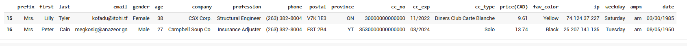
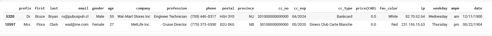
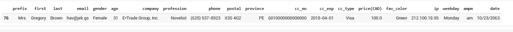
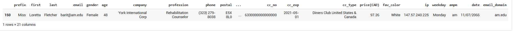

# Ecommerce Purchases Analysis

## 📌Overview
This project involves analyzing a synthetic dataset of ecommerce purchases to answer various business questions. The dataset contains 30,000 entries with customer information, purchase details, and payment information. The goal is to utilize the Pandas library in Python to perform data analysis and derive insights that can help the client understand their customer base better.

## 📚Table of Contents
- [Project Description](#Project_Description)
- [Dataset](#Dataset)
- [Installation](#Installation)
- [Usage](#Usage)
- [Results]([#Results)
- [Conclusion](#Conclusion)

## 📌Project Description
The project aims to analyze customer purchase behavior using a dataset that includes personal information, purchase details, and payment information. The analysis will help answer questions related to customer demographics, spending habits, and payment methods.

## 🚀 Dataset
The dataset is a CSV file named Cust_Purch_Data.csv and contains the following columns:
- prefix: Title of the customer (e.g., Mr., Mrs., Dr.)
- first: First name of the customer
- last: Last name of the customer
- email: Email address of the customer
- gender: Gender of the customer
- age: Age of the customer
- company: Company where the customer works
- profession: Profession of the customer
- phone: Phone number of the customer
- postal: Postal code of the customer
- province: Province of the customer
- cc_no: Credit card number
- cc_exp: Credit card expiration date
- cc_type: Type of credit card (e.g., Visa, MasterCard)
- price(CAD): Amount spent in Canadian dollars
- fav_color: Favorite color of the customer
- ip: IP address of the customer
- weekday: Day of the week when the purchase was made
- ampm: AM/PM indicator for the purchase time
- date: Date of the purchase

## 📊Technologies Used
- Python 3.x
- Pandas
- Google Colab (for running the Jupyter notebook)

## 📈Analysis Report Process program and output

**1. Import Pandas and Read the csv file**

```sql
 import pandas as pd

 #load file
 from google.colab import files
 files.upload()
```

**2. Its good idea to see how the data look like, display first 5 rows of your data-set.**
```sql
pay = pd.read_csv('Cust_Purch_Data.csv', encoding='utf-8')
pay.head()
```
Result:


**3. How many entries your data have? Can you tell the no. of columns in your data?**

```sql
pay.info()
```
Result:

```
Data columns (total 20 columns):
 #   Column      Non-Null Count  Dtype  
---  ------      --------------  -----  
 0   prefix      30000 non-null  object 
 1   first       30000 non-null  object 
 2   last        30000 non-null  object 
 3   email       30000 non-null  object 
 4   gender      30000 non-null  object 
 5   age         30000 non-null  int64  
 6   company     30000 non-null  object 
 7   profession  30000 non-null  object 
 8   phone       30000 non-null  object 
 9   postal      30000 non-null  object 
 10  province    30000 non-null  object 
 11  cc_no       30000 non-null  int64  
 12  cc_exp      30000 non-null  object 
 13  cc_type     30000 non-null  object 
 14  price(CAD)  30000 non-null  float64
 15  fav_color   30000 non-null  object 
 16  ip          30000 non-null  object 
 17  weekday     30000 non-null  object 
 18  ampm        30000 non-null  object 
 19  date        30000 non-null  object 
dtypes: float64(1), int64(2), object(17)
```

**4. What are the max and min ages of your customer? Can you find mean of your customer?**

```sql
print('Max. age of the customer is:  ', pay['age'].max())
print('Max. age of the customer is:  ', pay['age'].min())
print('Avg. age of the customer is:  ', pay['age'].mean())
```
Result:

```
Max. age of the customer is:   65
Max. age of the customer is:   18
Avg. age of the customer is:   41.550066666666666
```

**5. What are the three most common customer's names?**
```sql
common_names = pay['first'].value_counts().head(3)
common_names.name = 'first'
print(common_names)
```
Result:

```
Willie     130
Francis    124
Eula        86
Name: first, dtype: int64
```

**6. Two customers have the same phone number, can you find those customers?**

Two customers have the same phone number
```sql
duplicate_phones = pay['phone'].value_counts().head(2)
duplicate_phones.name = 'phone'
print(duplicate_phones.head(2))
```
Result:

```
(263) 382-8004    2
(712) 247-7037    1
Name: phone, dtype: int64
```

can you find those customers
```Sql
pay['phone'] = pay['phone'].astype(str)

pay[pay.duplicated('phone', keep=False)]
```
Result:



**7. How many customers have profession "Structural Engineer"?**

```sql
structural_engineers = pay[pay['profession'] == 'Structural Engineer']
count_columns = structural_engineers.count()
print(count_columns)
```
Result:

```
prefix        87
first         87
last          87
email         87
gender        87
age           87
company       87
profession    87
phone         87
postal        87
province      87
cc_no         87
cc_exp        87
cc_type       87
price(CAD)    87
fav_color     87
ip            87
weekday       87
ampm          87
date          87
dtype: int64
```

**8. How many male customers are 'Structural Engineer'?**
```sql
male_structural_engineers = pay[(pay['profession'] == 'Structural Engineer') & (pay['gender'] == 'Male')]
count_columns = male_structural_engineers.count()
print(count_columns)
```

Result:

```
prefix        43
first         43
last          43
email         43
gender        43
age           43
company       43
profession    43
phone         43
postal        43
province      43
cc_no         43
cc_exp        43
cc_type       43
price(CAD)    43
fav_color     43
ip            43
weekday       43
ampm          43
date          43
dtype: int64
```
**9. Find out the female Structural Engineers from province Alberta (AB)?**
```sql
pay[(pay['profession'] == 'Structural Engineer') & (pay['gender'] == 'Female') & (pay['province'] == 'AB')]
```

Result:


**10. What is the max, min and average spending?**
```sql
print('Max. spending:  ', pay['price(CAD)'].astype(float).max())
print('Mai. spending:  ', pay['price(CAD)'].astype(float).min())
print('Avg. spending:  ', pay['price(CAD)'].astype(float).mean())
```

Result:

```
Max. spending:   100.0
Mai. spending:   0.0
Avg. spending:   49.990775
```

**11. Who did not spend anything? Company wants to send a deal to encourage the customer to buy stuff!**

```sql
pay[pay['price(CAD)'] == 0.0]
```

Result:



**12. As a loyalty reward, company wants to send thanks coupon to those who spent 100CAD or more, please find out the customers?**

```sql
pay[pay['price(CAD)'] >= 100.0]
```

Result:



**13. How many emails are associated with this credit card number '5020000000000230'?**

```sql
# Ensure the 'cc_no' column is treated as a string
pay['cc_no'] = pay['cc_no'].astype(str)

# Remove any extra spaces in the credit card numbers
pay['cc_no'] = pay['cc_no'].str.strip()

# Filter for customers with the specified credit card number
emails_with_cc = pay[pay['cc_no'] == '5020000000000230']['email']

print(emails_with_cc)
```

Result:

```
0    sebvajom@kol.km
1      acu@jatsot.ug
Name: email, dtype: object
```

**14. We need to send new cards to the customers well before the expire, how many cards are expiring in 2019?**

```sql
# Specify the date format for 'cc_exp' column and convert it to datetime
pay['cc_exp'] = pd.to_datetime(pay['cc_exp'], format='%m/%d/%Y', errors='coerce')

# Filter the rows where the expiration year is 2019
expiring_in_2019 = pay[pay['cc_exp'].dt.year == 2019]

# Use count() to get the number of rows with expiration in 2019
count_expiring_2019 = expiring_in_2019['cc_exp'].count()

# Alternatively, use sum() to check if there is any non-null data
sum_expiring_2019 = (pay['cc_exp'].dt.year == 2019).sum()

print("Cards expiring in 2019 (count):", count_expiring_2019)
print("Cards expiring in 2019 (sum):", sum_expiring_2019)
```

Result:

```
Cards expiring in 2019 (count): 2684
Cards expiring in 2019 (sum): 2684
```

**15. How many people use Visa as their Credit Card Provider?**

```sql
pay[pay['cc_type'] == 'Visa']['cc_type'].count()
```

Result:

**1721**

**16. Can you find the customer who spent 100 CAD using Visa?**

```sql
pay[(pay['cc_type'] == 'Visa') & (pay['price(CAD)'] == 100)]
```

Result:


**17. What are two most common professions?**

```sql
pay['profession'].value_counts().head(2)
```

Result:

```
Preschool Teacher       112
Distribution Manager    107
```

**18. Can you tell the top 5 most popular email providers? (e.g. gmail.com, yahoo.com, etc...)**

```sql
# Extract the domain from the 'email' column
pay['email_domain'] = pay['email'].str.split('@').str[1]

# Get the top 5 most popular email providers
top_email_providers = pay['email_domain'].value_counts().head(5)

print(top_email_providers)
```

Result:

```
gmail.com      1687
me.com         1676
outlook.com    1664
live.com       1660
hotmail.com    1659
```

**19. Is there any customer who is using email with "am.edu"?**

```sql
pay[pay['email'].str.contains('am.edu', na=False)]
```

Result:



**20. Which day of the week, the store gets more customers?**

```sql
day_of_week_counts = pay['weekday'].value_counts()
days = day_of_week_counts.head(5)
print(days)
```

Result:

```
Saturday     4376
Wednesday    4365
Thursday     4327
Friday       4316
Monday       4216
```


